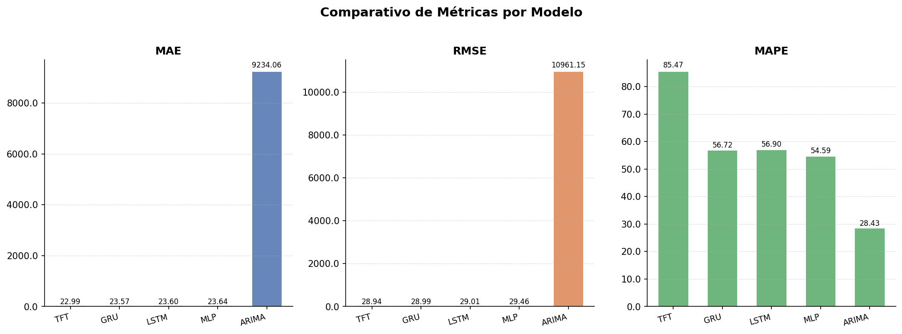
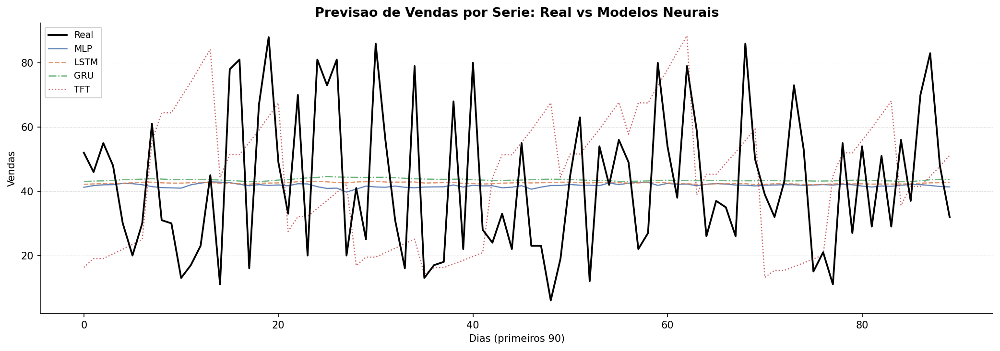

# Framework Genérico para Previsão de Demanda com Redes Neurais Profundas

**Disciplina:** Redes Neurais Artificiais  
**Instituição:** Universidade de Pernambuco — UPE  
**Autor:** Vanthuir Maia  
**Data:** Maio de 2026

---

## Resumo

[PREENCHER APÓS RESULTADOS FINAIS — aproximadamente 150 palavras cobrindo: contexto do problema, proposta do framework genérico, modelos avaliados (ARIMA, MLP, LSTM, GRU, TFT), dataset utilizado, principais resultados quantitativos (MAE/RMSE/MAPE) e conclusão sobre qual modelo apresentou melhor desempenho.]

**Palavras-chave:** previsão de demanda, redes neurais profundas, LSTM, GRU, Temporal Fusion Transformer, séries temporais.

---

## 1. Introdução

A previsão de demanda é um problema central em cadeias de suprimentos (*supply chains*), influenciando diretamente decisões de estoque, logística e produção. Erros sistemáticos nessa previsão resultam em dois cenários custosos: excesso de estoque, que imobiliza capital e aumenta custos de armazenagem, ou ruptura de estoque (*stockout*), que causa perda de vendas e insatisfação de clientes [CITAR]. Em ambientes varejistas com centenas de produtos e pontos de venda, a complexidade do problema é amplificada pela necessidade de modelar simultaneamente múltiplas séries temporais com padrões distintos de sazonalidade e tendência.

A literatura de previsão de demanda é dominada por duas abordagens. A primeira, baseada em modelos estatísticos clássicos como ARIMA (*Autoregressive Integrated Moving Average*), apresenta sólida fundamentação teórica mas dificuldade em capturar não-linearidades e dependências de longo prazo [CITAR]. A segunda, baseada em aprendizado de máquina e redes neurais profundas, demonstra maior capacidade de representação, mas frequentemente resulta em implementações específicas por dataset, com pipelines de pré-processamento acoplados à arquitetura do modelo.

Este trabalho propõe e avalia um **framework genérico de previsão de demanda** que: (i) aceita como entrada qualquer arquivo CSV contendo uma coluna de data e uma coluna numérica alvo, sem modificação de código; (ii) executa automaticamente o pré-processamento completo — extração de features temporais, criação de lags e médias móveis, normalização e geração de janelas deslizantes; e (iii) suporta múltiplas arquiteturas de redes neurais com interface unificada, permitindo comparação direta entre modelos. O framework é avaliado sobre o dataset *Store Item Demand Forecasting* do Kaggle, composto por 500 séries de vendas diárias ao longo de cinco anos, comparando ARIMA como baseline estatístico contra MLP, LSTM, GRU e o estado da arte em Transformers para séries temporais, o *Temporal Fusion Transformer* (TFT).

O restante do artigo está organizado da seguinte forma: a Seção 2 apresenta o referencial teórico sobre séries temporais e os modelos avaliados; a Seção 3 descreve a metodologia, incluindo o dataset, o pipeline de pré-processamento e o protocolo de avaliação; a Seção 4 apresenta os resultados experimentais; a Seção 5 discute os achados e limitações; e a Seção 6 conclui o trabalho com perspectivas futuras.

---

## 2. Referencial Teórico

### 2.1 Séries Temporais e Previsão de Demanda

Uma série temporal é uma sequência de observações indexadas no tempo, $\{y_t\}_{t=1}^{T}$, onde o objetivo de previsão é estimar $\hat{y}_{T+h}$ dado o histórico observado até $T$, sendo $h$ o horizonte de previsão. Em contextos de previsão de demanda no varejo, cada série corresponde a uma combinação produto-loja, e o conjunto de séries a ser previsto simultaneamente pode chegar a dezenas de milhares em redes varejistas de grande porte [CITAR].

As principais fontes de variação em séries de demanda são: **tendência** (crescimento ou declínio secular), **sazonalidade** (padrões recorrentes intra-semana, mensais ou anuais), **efeitos de calendário** (feriados, promoções) e **ruído** (variações aleatórias irredutíveis). O sucesso de qualquer modelo de previsão depende de sua capacidade de decompor e aprender esses componentes a partir de dados históricos.

### 2.2 ARIMA como Baseline Estatístico

O modelo ARIMA(*p*, *d*, *q*), introduzido por Box e Jenkins (1976), combina um processo autoregressivo de ordem *p*, uma diferenciação de ordem *d* para indução de estacionariedade, e uma componente de média móvel de ordem *q* [CITAR BOX-JENKINS]. Apesar de sua idade, o ARIMA permanece como baseline competitivo em benchmarks de previsão [CITAR MAKRIDAKIS M-COMPETITIONS], especialmente para séries univariadas com poucos dados históricos.

A principal limitação do ARIMA no contexto deste trabalho é sua natureza univariada: ele não incorpora features exógenas (como dia da semana ou período do mês) sem extensão para o modelo ARIMAX, e não escala naturalmente para previsão de múltiplas séries simultaneamente. Neste trabalho, o ARIMA é treinado sobre a **série agregada** (soma diária de todas as 500 séries), servindo como referência de baseline de baixo custo computacional.

### 2.3 Redes Neurais para Séries Temporais

**MLP (Multilayer Perceptron):** A arquitetura mais simples de rede neural densa, aplicada a séries temporais via janela deslizante (*sliding window*): a janela de *W* passos anteriores é linearizada em um vetor e passado como entrada para camadas densas totalmente conectadas. Embora desconsidere a ordem temporal intrínseca dos dados, o MLP serve como linha de base para avaliar o ganho das arquiteturas recorrentes [CITAR].

**LSTM (*Long Short-Term Memory*):** Proposta por Hochreiter e Schmidhuber (1997), a LSTM resolve o problema do gradiente que desaparece (*vanishing gradient*) das RNNs simples por meio de três portas de controle — entrada, esquecimento e saída — e um vetor de estado de célula que persiste informação ao longo do tempo [CITAR HOCHREITER]. Essa capacidade de memorizar dependências de longo prazo tornou a LSTM a arquitetura dominante em previsão de séries temporais por mais de uma década [CITAR].

**GRU (*Gated Recurrent Unit*):** Proposta por Cho et al. (2014) como simplificação da LSTM, a GRU combina as portas de entrada e esquecimento em uma única porta de atualização e elimina o estado de célula separado, reduzindo o número de parâmetros sem degradação significativa de desempenho em muitas tarefas [CITAR CHO]. A maior eficiência computacional da GRU é particularmente relevante em cenários de treinamento em CPU.

### 2.4 Transformers para Séries Temporais: TFT

O *Temporal Fusion Transformer* (TFT), proposto por Lim et al. (2021), é uma arquitetura baseada em atenção especialmente projetada para previsão de séries temporais multivariadas [CITAR LIM TFT]. O TFT introduz quatro mecanismos-chave: (i) *Variable Selection Networks* (VSN), que aprendem a ponderar a importância de cada feature de entrada; (ii) codificação estática para capturar atributos invariantes no tempo de cada série; (iii) LSTM como *encoder-decoder* local para capturar dependências temporais de curto prazo; e (iv) atenção multi-cabeça interpretável para capturar dependências de longo alcance. Essa combinação torna o TFT o estado da arte em benchmarks públicos de previsão de séries temporais [CITAR].

### 2.5 Trabalhos Relacionados

Ahmed et al. (2022), em *"Demand Forecasting Model using Deep Learning Methods"* (IJACSA, 2022), propõem uma comparação entre ARIMA, LSTM e GRU para previsão de demanda em e-commerce, reportando que modelos de aprendizado profundo superam o ARIMA em séries com sazonalidade complexa e que a GRU apresenta razão desempenho/custo favorável em relação à LSTM. Este trabalho se diferencia ao (i) incluir o TFT como representante de estado da arte, (ii) propor um pipeline genérico reutilizável e (iii) avaliar a escalabilidade para 500 séries simultâneas.

---

## 3. Metodologia

### 3.1 Dataset

O dataset utilizado é o *Store Item Demand Forecasting Challenge*, disponível publicamente no Kaggle. O conjunto contém **913.000 registros** de vendas diárias de 50 itens em 10 lojas, cobrindo o período de 01/01/2013 a 31/12/2017 (1.826 dias). Cada registro é identificado pela tupla (data, loja, item) e contém o volume diário de vendas como variável alvo.

| Característica | Valor |
|---|---|
| Período | 01/01/2013 – 31/12/2017 |
| Número de lojas | 10 |
| Número de itens | 50 |
| Número de séries | 500 |
| Total de registros | 913.000 |
| Frequência | Diária |
| Variável alvo | `sales` (volume de vendas) |

O dataset não apresenta valores ausentes nem datas duplicadas por série. Após o pré-processamento descrito na Seção 3.2, o número de registros é reduzido para **898.000 linhas** pela remoção dos primeiros 30 dias de cada série (necessários para o cálculo de lags).

### 3.2 Pipeline de Pré-Processamento

O pipeline é implementado em três etapas encadeadas, todas de forma genérica — a única informação necessária é o nome da coluna de data e da coluna alvo.

**Etapa 1 — Extração de Features Temporais:** A partir da coluna de data, são extraídas 9 features de calendário: dia do mês, dia da semana (0=segunda, 6=domingo), semana do ano, mês, trimestre, ano, indicador de fim de semana, indicador de início de mês (dia ≤ 5) e indicador de fim de mês (dia ≥ 25). Essas features codificam padrões sazonais sem que os modelos precisem inferir a estrutura temporal implicitamente.

**Etapa 2 — Features de Histórico:** São criadas 5 features derivadas do histórico de vendas: lags de 1, 7 e 30 dias (capturando dependência de curto, médio e longo prazo, respectivamente) e médias móveis de 7 e 30 dias (capturando tendência local). Todas são calculadas dentro de cada série (loja × item) para evitar vazamento entre séries. As primeiras 30 observações de cada série são descartadas por conterem NaN.

**Etapa 3 — Divisão, Normalização e Janelas:** A divisão treino-teste é **estritamente temporal**: tudo antes de 06/01/2017 compõe o treino (718.000 registros, ~80%) e a partir dessa data compõe o teste (180.000 registros, ~20%). O `MinMaxScaler` é ajustado (*fit*) exclusivamente sobre o treino e aplicado no teste, evitando *data leakage*. Para os modelos neurais baseados em janelas, a função `criar_janelas` gera arrays $X \in \mathbb{R}^{N \times 30 \times 14}$ e $y \in \mathbb{R}^{N}$.

O TFT recebe um `TimeSeriesDataSet` do framework *pytorch-forecasting*, que trata internamente a indexação temporal e a normalização por grupo (*GroupNormalizer* com transformação *softplus*).

### 3.3 Arquiteturas e Hiperparâmetros

A tabela abaixo resume as configurações utilizadas em cada modelo:

| Parâmetro | ARIMA | MLP | LSTM | GRU | TFT |
|---|---|---|---|---|---|
| Ordem / Arquitetura | (1,1,1) | 420→128→64→1 | 14→64→32→1 | 14→64→32→1 | hidden=32, heads=4 |
| Parâmetros treináveis | — | 62.209 | 32.673 | 24.801 | 118.565 |
| Dropout | — | 0,2 | 0,2 | 0,2 | 0,1 |
| Otimizador | — | Adam | Adam | Adam | Adam |
| Função de perda | — | MSE | MSE | MSE | QuantileLoss |
| *Batch size* | — | 512 | 512 | 512 | 64 |
| Épocas máximas | — | 50 | 50 | 50 | 20 |
| *Early stopping* | — | patience=10 | patience=10 | patience=10 | patience=5 |
| Janela de contexto | — | 30 dias | 30 dias | 30 dias | 30 dias |
| Horizonte de predição | 360 dias¹ | 1 passo | 1 passo | 1 passo | 7 dias |

¹ O ARIMA é treinado na série agregada (soma de 500 séries) e gera previsões para todo o período de teste de uma vez (*out-of-sample forecast*).

### 3.4 Protocolo de Avaliação

Três métricas são calculadas para cada modelo:

$$\text{MAE} = \frac{1}{N} \sum_{i=1}^{N} |y_i - \hat{y}_i|$$

$$\text{RMSE} = \sqrt{\frac{1}{N} \sum_{i=1}^{N} (y_i - \hat{y}_i)^2}$$

$$\text{MAPE} = \frac{100\%}{N} \sum_{i=1}^{N} \left| \frac{y_i - \hat{y}_i}{y_i} \right|, \quad y_i \neq 0$$

Amostras com $y_i = 0$ são excluídas do cálculo do MAPE para evitar divisão por zero. Todos os experimentos são executados em CPU (Intel, Windows 11), sem aceleração por GPU.

**Nota metodológica sobre escala:** O ARIMA opera sobre a **série agregada** (total diário de todas as 500 séries, escala ~20.000 unidades/dia), enquanto os modelos neurais operam sobre séries individuais por loja e item (escala ~50 unidades/dia). Os resultados absolutos de MAE e RMSE não são diretamente comparáveis entre ARIMA e os modelos neurais; o MAPE, por ser adimensional, permite uma comparação relativa. Essa limitação é discutida na Seção 5.2.

---

## 4. Resultados

### 4.1 Tabela Comparativa

[PREENCHER APÓS RESULTADOS FINAIS]

| Modelo | MAE | RMSE | MAPE (%) |
|---|---|---|---|
| ARIMA (baseline)¹ | — | — | — |
| MLP | — | — | — |
| LSTM | — | — | — |
| GRU | — | — | — |
| TFT | — | — | — |

¹ Escala de vendas agregadas (~20.000/dia); demais modelos em escala por série (~50/dia).

### 4.2 Comparativo de Métricas

*Figura 1: Comparativo de MAE, RMSE e MAPE entre os cinco modelos avaliados. Valores menores indicam melhor desempenho. [ATUALIZAR APÓS RESULTADOS FINAIS]*

### 4.3 Predições vs. Valores Reais

*Figura 2: Série temporal real versus predições dos modelos neurais (MLP, LSTM, GRU, TFT) para os primeiros 90 dias do período de teste. O gráfico ilustra a capacidade de cada modelo de acompanhar as variações de demanda. [ATUALIZAR APÓS RESULTADOS FINAIS]*

### 4.4 Análise por Modelo

**ARIMA:** [PREENCHER — comentar sobre o MAPE obtido (~29% esperado com ARIMA(1,1,1) simples), a incapacidade do modelo de capturar a sazonalidade semanal sem componente sazonal explícita, e a viabilidade como baseline de baixo custo.]

**MLP:** [PREENCHER — comentar sobre o desempenho relativo ao ARIMA, ganho pela capacidade de incorporar as 14 features de entrada, e limitação por não modelar explicitamente a estrutura temporal sequencial (diferentemente de LSTM e GRU).]

**LSTM:** [PREENCHER — comentar sobre o desempenho frente ao MLP, ganho das células recorrentes em capturar dependências temporais, tempo de treinamento versus GRU.]

**GRU:** [PREENCHER — comentar sobre o desempenho frente à LSTM, trade-off parâmetros vs. desempenho (24.801 vs. 32.673 parâmetros), tempo de convergência.]

**TFT:** [PREENCHER — comentar sobre o desempenho frente aos demais, capacidade de modelar 500 séries simultaneamente com embeddings por série, horizonte de 7 dias, e se os mecanismos de atenção e seleção de variáveis trouxeram ganho mensurável no dataset avaliado.]

---

## 5. Discussão

### 5.1 Interpretação dos Resultados

[PREENCHER APÓS RESULTADOS FINAIS — discutir qual modelo apresentou melhor MAPE, se o TFT superou os modelos recorrentes como esperado pela literatura, e se a diferença de desempenho justifica o custo computacional adicional. Comentar sobre a importância das features de lag e média móvel como preditores relevantes.]

### 5.2 Limitações do Experimento

**Escala de comparação ARIMA vs. neurais:** Como mencionado na Seção 3.4, o ARIMA é treinado e avaliado em escala agregada, o que torna a comparação de métricas absolutas inadequada. Uma comparação metodologicamente rigorosa exigiria ou (i) treinar 500 modelos ARIMA individuais — o que é computacionalmente viável mas impraticável para fins de comparação rápida — ou (ii) agregar as predições dos modelos neurais para a escala diária total.

**Ausência de GPU:** Todos os experimentos foram executados em CPU. Os modelos neurais, especialmente LSTM, GRU e TFT, foram configurados com arquiteturas reduzidas (hidden_size=32–64) para viabilizar o treinamento em tempo razoável. Arquiteturas maiores podem apresentar desempenho superior com aceleração por GPU.

**Janela deslizante global:** A função `criar_janelas` desliza sobre o DataFrame completo, e a janela de 30 passos pode cruzar fronteiras entre séries (loja × item diferentes) em datas de transição. Para MLP e LSTM/GRU treinados em múltiplas séries, esse efeito é equivalente a um *implicit mixing* e pode ser interpretado como uma forma de regularização por transfer entre séries ou como ruído de treinamento, dependendo da perspectiva.

**Horizonte do TFT:** O TFT foi avaliado em horizonte de 7 dias por série, enquanto MLP/LSTM/GRU foram avaliados em predição de 1 passo à frente. Uma comparação equitativa requereria o mesmo horizonte para todos os modelos.

### 5.3 Generalização do Framework

O principal resultado de engenharia deste trabalho é o **framework genérico**: qualquer CSV com coluna de data e coluna alvo numérica pode ser submetido ao pipeline sem alteração de código. A detecção automática da coluna de data reconhece os nomes `date`, `data`, `timestamp` e `dt`; a validação verifica existência de coluna numérica e ausência de duplicatas por grupo. Esse design foi validado sobre o dataset Kaggle e é transferível para outros contextos de previsão de demanda (e-commerce, hospitalar, energética), bastando ajustar as variáveis de configuração no topo de `main.py`.

---

## 6. Conclusão

Este trabalho apresentou um framework genérico para previsão de demanda baseado em redes neurais profundas, avaliando cinco modelos — ARIMA, MLP, LSTM, GRU e TFT — sobre um dataset de 500 séries de vendas diárias com 5 anos de histórico. O pipeline automatiza as etapas de ingestão, validação, extração de features temporais, normalização e criação de janelas deslizantes, mantendo uma interface unificada entre arquiteturas.

[PREENCHER — síntese dos resultados: qual modelo venceu, por quanto em MAPE, se o TFT mostrou vantagem relativa ao custo computacional, e o comportamento do baseline ARIMA.]

A principal contribuição prática é a **reusabilidade do pipeline**: o framework pode ser aplicado a novos datasets de demanda com custo de adaptação mínimo, acelerando ciclos de experimentação em contextos industriais e acadêmicos.

Como trabalhos futuros, identificam-se: (i) extensão para previsão **hierárquica** (reconciliação de previsões no nível loja → rede), onde o TFT tem vantagem estrutural; (ii) avaliação sobre datasets de outros domínios (energia elétrica, fluxo hospitalar, demanda de transporte) para validar a generalidade do framework; (iii) treinamento com GPU e arquiteturas de maior capacidade; e (iv) inclusão de variáveis exógenas conhecidas (promoções, feriados, preço) como *time-varying known inputs* no TFT.

---

## Referências

BOX, G. E. P.; JENKINS, G. M.; REINSEL, G. C. **Time Series Analysis: Forecasting and Control**. 3. ed. Englewood Cliffs: Prentice Hall, 1994.

CHO, K. et al. Learning Phrase Representations using RNN Encoder-Decoder for Statistical Machine Translation. In: **Proceedings of EMNLP 2014**. Doha: ACL, 2014. p. 1724–1734.

HOCHREITER, S.; SCHMIDHUBER, J. Long Short-Term Memory. **Neural Computation**, v. 9, n. 8, p. 1735–1780, 1997.

LIM, B. et al. Temporal Fusion Transformers for Interpretable Multi-horizon Time Series Forecasting. **International Journal of Forecasting**, v. 37, n. 4, p. 1748–1764, 2021.

MAKRIDAKIS, S.; SPILIOTIS, E.; ASSIMAKOPOULOS, V. The M4 Competition: 100,000 time series and 61 forecasting methods. **International Journal of Forecasting**, v. 36, n. 1, p. 54–74, 2020.

AHMED, [COMPLETAR NOME COMPLETO]. Demand Forecasting Model using Deep Learning Methods. **International Journal of Advanced Computer Science and Applications (IJACSA)**, v. 13, n. [COMPLETAR], 2022.

KAGGLE. **Store Item Demand Forecasting Challenge**. Disponível em: https://www.kaggle.com/competitions/demand-forecasting-kernels-only. Acesso em: maio 2026.

[ADICIONAR DEMAIS REFERÊNCIAS CONFORME NECESSÁRIO]
